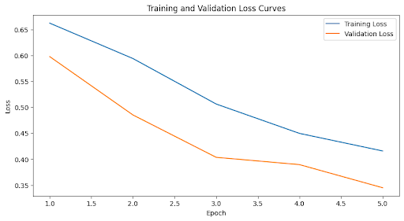
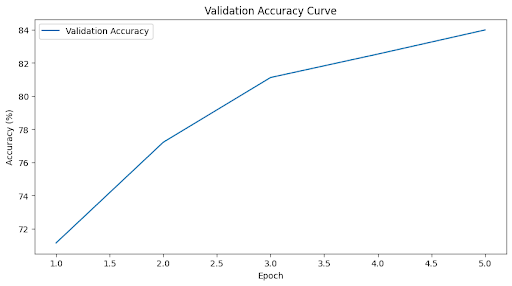
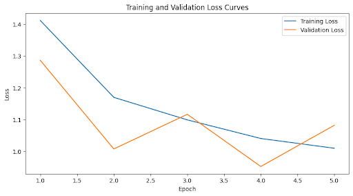
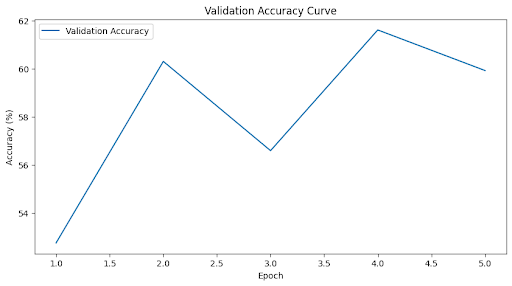

# Convolutional Neural Networks

# Classification of Faces

#### University of California, San Diego 2025

Written by: Kanishka Katragadda

Mar 22, 2025

## Abstract

Classification of faces is a fundamental task in computer vision and deep learning. I used
convolutional neural network (CNN) architecture to classify images based on their gender
and age range. CNNs are powerful tools that use convolution to create feature maps from
images and learn patterns that can be used in such discriminative machine-learning tasks.
Various architectures, optimizers, and data preprocessing techniques were employed to
achieve this goal. Two CNNs were created and trained using the open source deep learning
library PyTorch for performing two classification problems, age classification and gender
classification, with several experimental modifications made to the models to improve
performance metrics, accuracy in our case.

## Introduction & Background

To solve the problem of image classification, convolution is critical for detecting and
extracting features from an image. Within the context of deep learning, convolutional layers
are employed within the neural network alongside activation functions to provide
non-linearity, and pooling to reduce the extensive computational expenses. The key to the
success of convolutional neural networks lies in weight sharing and local connectivity,
which allow for a significantly reduced number of weights and an overall lower model

complexity. By doing this, we can extract features from images and use them for
probabilistic classification of the images to desired output classes such as male or female.
Such extraction of features from face images in particular has become crucial in many
applications such as security, criminal justice, and device authentication. As neural
networks have reached higher levels of complexity, these classification tasks have become
more specific, down to individual persons rather than demographics of people.
Outside of facial recognition, convolutional neural networks are used in a variety of other
computer vision tasks. For instance, CNNs have seen use in radiology due to not requiring
manual segmentation of organs and tumors by human experts.
Due to the high complexity of image-based data, computer vision tasks are often riddled
with challenges attributed to the curse of dimensionality. We want to address a more classic
computer vision task in this paper, involving the broad classification of facial images into
easily definable categories. This will be performed on a simple and relatively small dataset
of face images with a variety of ages, genders, and ethnicities.

## Methodology

### Dataset

The convolutional neural network models that were implemented in this project were
trained on a modified and preprocessed version of the UTKFace dataset, with over 20000
labeled images of faces to train the models on. The specified dataset has been provided in
the references section. While the dataset has been preprocessed, additional preprocessing
steps were required to take for the model to function correctly. A small portion of images in
the dataset did not have consistent pixel counts with the overwhelming majority at 2304
pixels. As this subsample was extremely small, the images were dropped from the dataset.
After this, several other steps were taken to prepare the images and the dataset to be input
into the model. We first had to convert each image into a 48x48 grayscale matrix where the
pixel values have been normalized to a range of 0 to 1. After placing it into the **(batch_size,
channels, height, width)** format that PyTorch expects, the standard random 80% training

and 20% testing split was performed and the Datasets and Dataloaders were created. For
the AgeCNN specifically, the ages were discretized into age ranges to reduce the number of
output classes.

### Model Architecture

Initial experiments were conducted solely with gender classification before the same
architecture was duplicated and optimized for age classification. The initial model started
with two convolutional layers and was quickly expanded to three layers due to underfitting.
Non-linearity was provided through the common **Rectified Linear Unit (ReLU)** activation
function for all the layers with **MaxPool** used as the pooling operation to reduce spatial
dimensions. All convolutional layers use a stride of 1, indicating the filter slides one pixel at
a time, and a padding of 1 to maintain output size. **Batch normalization** was also used as is
common to speed up training time. The first layer had 32 filters, doubling each time to
reach 128 filters for the final layer.
Within the fully connected layers, the multi-dimensional feature maps were flattened and
then passed through a fully connected layer that takes an input of flattened features shaped
as 128 channels times 6x6 spatial dimensions to produce 256 neurons. Another ReLU
activation function was used alongside dropout to prevent overfitting. **Dropout** is a
regularization technique that randomly deactivates a set of neurons in the network to
prevent them from forming codependence, where multiple nodes depend on the output of a
single node, and overall reducing of overfitting, is the primary goal of regularization. The
final fully connected layer reduces the output to the two output classes (male and female).

### Training Process

The training of the neural networks used the **cross-entropy loss** function, a very common
loss function for optimization of machine learning models performing multiclass
classification, by calculating the difference between the predicted probability distribution
and the actual distribution.
For the optimizer, I experimented with Stochastic Gradient Descent (SGD) and Adam
optimizers and found little difference between the validation loss with these two methods. I

ended up opting for SGD with momentum, a modification of gradient descent that
essentially aggregates the gradients from the previous gradient steps into the current step
to increase convergence speed. The learning rate was also adjusted as a hyperparameter,
though that too had very little effect on either of the models. The loss and accuracy curves
for both models are shown in Figures 1 through 4 in the Results section. Afterward, the
main training and evaluation loops were run with varying numbers of epochs and evaluated
for loss.

## Results and Discussion

### Model Performance

The final results of the experiment were somewhat mixed, with the networks for gender
and age classification having different levels of performance. The higher complexity model
managed to increase the gender classification accuracy from 67.5% to the final accuracy of
84%. The model for age struggled to improve accuracy even through training despite
experimenting with different architecture, optimizers, and hyperparameters, it could not
climb past a validation accuracy of 60%.

#### GenderCNN

Starting with the analysis of the gender CNN, we have the loss curves in Figure 1. For the
gender model, the loss consistently decreased with subsequent epochs, showing little signs
of overfitting due to the low validation loss.

  
   
  <em>Figure 1: GenderCNN Training and Validation Loss Curves</em>

The validation accuracy consistently increased over the five epochs, reaching 84%
accuracy by the end as shown in Figure 2. The accuracy did not seem to be increasing with
any further architecture or hyperparameter adjustments which led me to my theory on the
nature of the classification.

  
   
  <em>Figure 2: GenderCNN Accuracy Curve</em>

I believed that the model was performing well on images of adults, but struggling on images
of young children that do not have distinct sexual characteristics. I created a separate
evaluation loop that would return separate accuracies for children 2 and under and
children over 2 and adults. The finding was the model had nearly 87% accuracy on people
over 2 years old, but only 45% accuracy on those 2 and younger. This makes sense, as
children this young will essentially be a coin flip for the model due to how similar the
features are.

#### AgeCNN

The age classification task did not perform as well as the gender classification task. Though
initial results seemed promising, the results were not reproducible. Subsequent training of
the network could not reproduce the original promising results. The architecture currently
uses the same as the GenderCNN, though it has been modified several times with hopes of
producing better results to no avail.

  
   
  <em>Figure 3: AgeCNN Training and Validation Loss Curves</em>

  

  
   
  <em>Figure 4: AgeCNN Accuracy Curve</em>

The reason for this discrepancy between the two models is currently unknown. One
possible explanation is that certain age groups are underrepresented, and the majority of
images come from people ages 20 to 40, producing results only within those ranges.

Adjustments to the discretized ranges did little to affect the performance, so there is little
conclusive evidence as to the reason for the poor training and accuracy. It’s also possible
that this is not suited to classification tasks and that regression would have been a better
choice for making predictions on age.

## Conclusion

In this experiment, we were able to create predictive models using convolutional neural
networks capable of extracting features from a dataset and learning patterns from which
they can make predictions on testing data. We tested several different architectures,
optimization techniques, and hyperparameter tuning to find the models that would give us
better results. The gender predictive model ended up being the more successful of the two
despite its struggles with predicting children’s faces, it had good accuracy on people over
the age of two, which is still a strong performance. The age CNN will likely require data
augmentation or a fundamental rethinking of the architecture and the task being
performed to bring its performance up to par with the gender model.
This study shows the power of convolutional networks in facial classification, whilst also
showing some of the shortcomings of these predictive models that could be enhanced
through transfer learning, better data, or perhaps even transformer architecture which is
still in its early stages for computer vision.

## References

Dataset:
https://www.kaggle.com/datasets/nipunarora8/age-gender-and-ethnicity-face-data-csv
Yamashita, R., Nishio, M., Do, R. K. G., & Togashi, K. (2018, June 22). _Convolutional Neural
Networks: An overview and application in radiology - insights into imaging_. SpringerLink.
https://link.springer.com/article/10.1007/s13244-018-0639-

Z. Li, F. Liu, W. Yang, S. Peng and J. Zhou, "A Survey of Convolutional Neural Networks:
Analysis, Applications, and Prospects," in IEEE Transactions on Neural Networks and
Learning Systems, vol. 33, no. 12, pp. 6999-7019, Dec. 2022, doi:
10.1109/TNNLS.2021.3084827.
keywords: {Convolutional neural networks;Feature extraction;Neurons;Deep
learning;Computer vision;Computer vision;convolutional neural networks (CNNs);deep
learning;deep neural networks},

